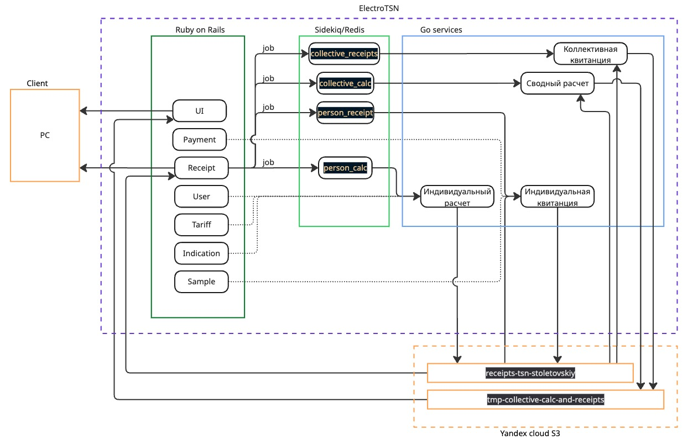

### Ruby
| Column | Task | Lang |
|----------|----------|----------|
| 1    | Обработка и валидация CSV   | GO   |
| 2    | Расчёт платы, генерация квитанций   | GO   |
| 3    | API для фронта  | Шаблоны Slim |
| 4    | Админка/форма ввода  | gem Trestl |
| 5    | Связь между сервисами  | rails создает инстанс receipt и посылает джобу в редис. go слушает редис, считает, создает квитанцию и кладет ее в с3, меняет статус инстанса на 3 (done) |

